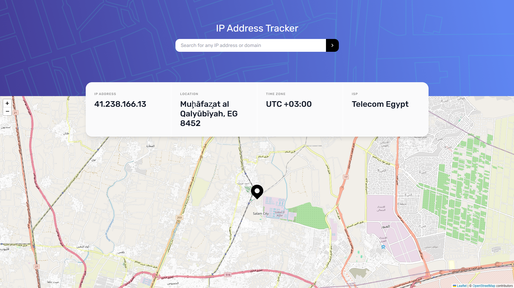

## IP Location Tracker

The Project is all about building IP Address Tracker app and get it looking as close to the design as possible.

The task was to build out the project to the designs. The mobile and a desktop version of the design is available on `ui-desgin` folder

### Tools

- To get the IP Address locations, [IP Geolocation API by IPify](https://geo.ipify.org/).

- To generate the map, [LeafletJS](https://leafletjs.com/).


### Features
Users are able to:

- View the optimal layout for each page depending on their device's screen size
- See hover states for all interactive elements on the page
- See their own IP address on the map on the initial page load
- Search for any IP addresses or domains and see the key information and location


### Demo



### Run The project
Make sure Node is installed
1. Clone the project
2. Install Dependences 
```bash
npm install
```
3. Run the project
```bash
npm run dev
```
4. Go to `localhost:5173`

---

⚠️ **IMPORTANT** ⚠️: To use the IP Geolocation API by IPify, you'll need to sign up for a free account. You won't need to add any cards details to do this and it's a very quick process. This will generate an API Key for you. Usually, you would be able to restrict your API Key to a specific URL (your own domain). This makes sure that other people can't use your API Key on their own websites. IPify doesn't have this feature, but because you aren't adding your card details, this isn't an issue. **So be sure to only sign up for the free account and DO NOT enter any card details**.

